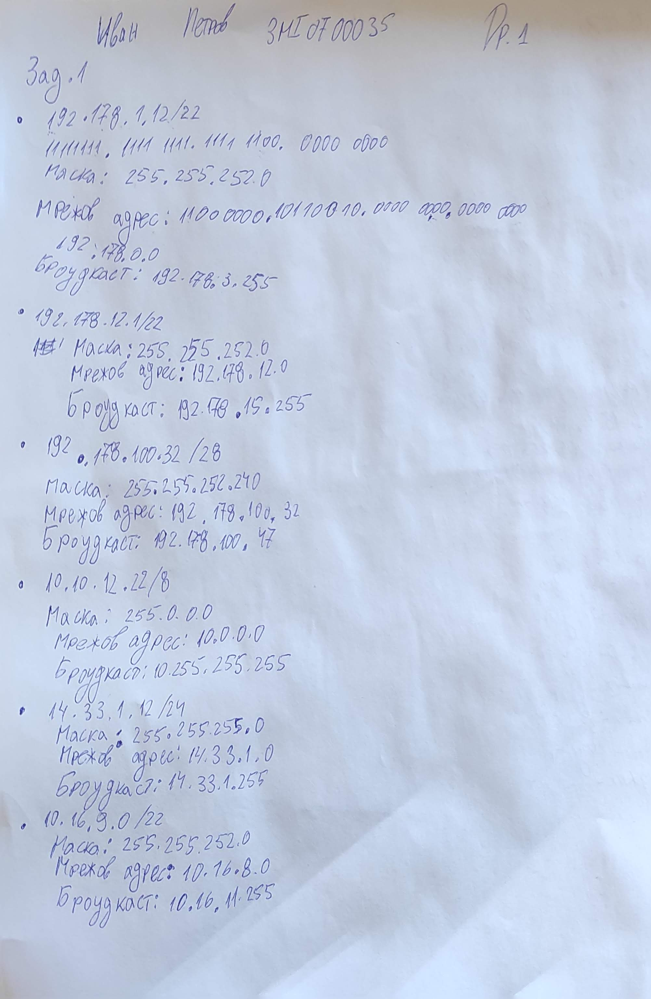
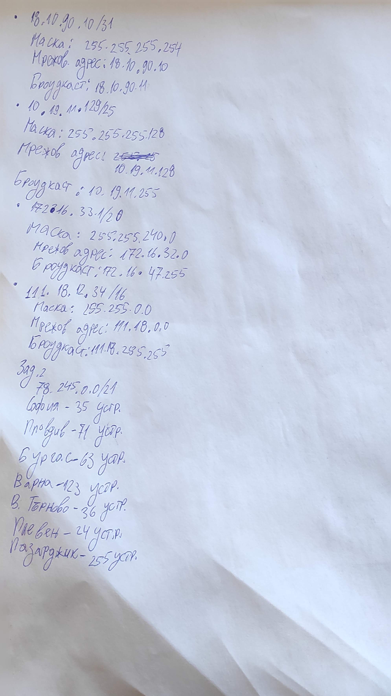
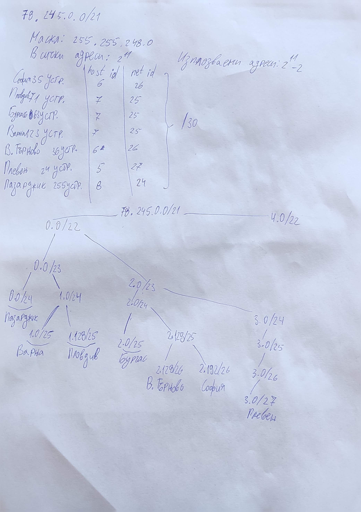

<pre>
Зад.1 Определете мрежовите адреси на следните комбинации IP адрес/мрежова
маска (мрежови адрес, мрежова маска, broadcast):
o 192.178.1.12/22
o 192.178.12.1/22
o 192.178.100.32/28
o 10.10.12.22/8
o 14.33.1.12/24
o 10.16.9.0/22
o 18.10.90.10/31
o 10.19.11.129/25
o 172.16.33.1/20
o 111.18.12.34/16

Зад.2 Направете оптимално (ако е възможно оставете резерв за бъдещо
разширяване) разпределение на мрежата 78.245.0.0/21 за следните офиси и
връзките между тях (всички офиси са свързани само към офиса в София):
o София – 35 IP устройства
o Пловдив – 71 IP устройства
o Бургас – 63 IP устройства
o Варна – 123 IP устройства
o Велико Търново – 36 IP устройства
o Плевен – 24 IP устройства
o Пазарджик - 255 IP устройства
</pre>

