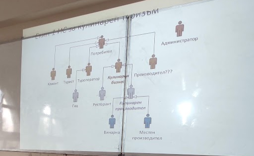
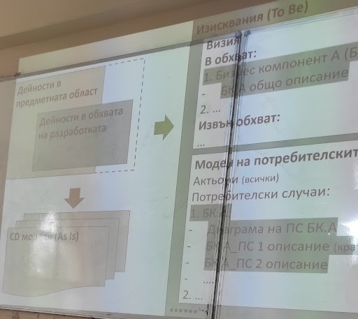
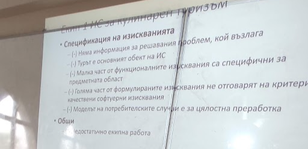

# Записки от обратна връзка 07.05.2025

## Анализи на системата

- Да се провери индивидуалната част на Петя
- Харесало им е обхват на системата и структурирания анализ, трябва да се вкара повече такава структура и дълбок анализ в нашите екипни и индивидуални части
- Трябва по-задълбочени анализи, също така повече анализи
- Трябва да определим критерии за оценка на системите

## Stakeholder-и

- Много са абстрактни и общи описанията, трябва детайлизация или да се обединят няколко роли в една (Пример: Винарна и Местен производител са напълно еднакви в текущото си състояние)
- Трябва да се добавят още (Ролите са много малки, Кулинарен производител, няма как да прави турове постоянно, защото кога ще произвежда)
- Трябва да се добавят повече специфични експерти

## Изисквания

- Не ги интересуват общи изисквания, искат повече детайли
- Има много повторения
- Някои изисквания са напълно нелогични (Пример: поддържаме 100 туриста едновременно )
- Изискванията трябва да са по-описателни, какво добавят към системата, а не абстрактни (Специфики на нашите функционалности)
- Трябва да се разгледат текущите бизнес обекти и техните характеристики за анализ на данни, допълнителни изисквания и други
- Нужна е класификация на функционалните изисквания

## CD модели

- Описано е бъдещото състояние и трябва да се преправят за текущото състояние
- Избраните формати са добре направени 
- Платежна система и Ресторант не са stakeholder-и / роля, а място

## Use-Cases 

### Use-Case Диаграма

- Нужно е да се раздели на под диаграми
- Може би ни е нужна таблица за взаимовръзка между случаи и актьори
- Актьорите са напълно объркани
    - Обединяване на роли
    - Грешни връзки
    - Грешни посоки на стрелки
    - Актьори в диаграмата без да работят със системата
    - Ненужни актьори и липсващи нужни актьори

### Потребителски Случаи
- Casual формата е близо до full формат, а не е трябвало (Трябва всички Casual да станат full за 2-рата част, тоест да се детайлизират)
- Липсват детайли и специфики в потребителските случаи
- Има множество повторения
    - Влизане в системата (Да се изведе в отделен use-case), 
    - Някои потребителски случаи са припокриващи се (Една и същи функционалност на много места)
    - Не е нужно алтернативни сценарии за всеки път, когато се въведе някоя форма грешно

### Визия
- Описанията на потребителски случаи участват в обхват на визията

## Цялостна екипна и индивидуална част

- Личи си, че се разчитало на отборна работа, без предварителна подготовка
- Ще очакват да се работи повече преди самите срещи, за да се обсъдят на среща и да се валидират с асистента или лектора нашите заключения
- Цялостно частта за "Какво имаме досега" сме я направили за бъдещата система.
- Цялостно информацията е неструктурирана и объркваща (Нужна е цялостно пренареждане)
- Трябва да разгледаме и добавим FURPS допълнителни изисквания
- Индивидуалните проекти имат идеи и елементи, които е добре да се включат и в екипния доклад
- Цялата индивидуална работа се включва в екипния проект
- Трябва да не се фокусираме върху връзка Турист -> Туроператор, тъй като повечето туристи не са през агенция
- Трябва да намалим фокуса, върху турове и да разгледаме изживявания организирани/посетени от самите туристи. Разглеждане на турове без посредник

