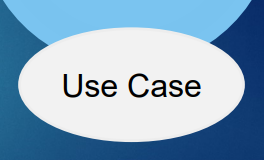
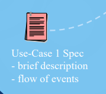
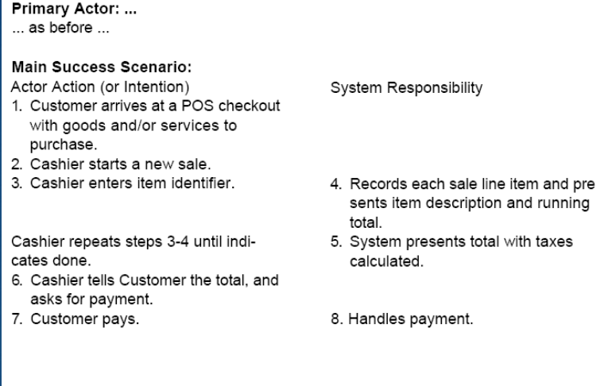
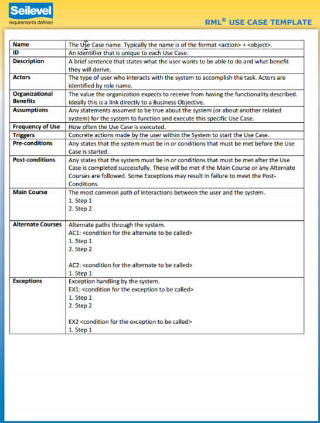
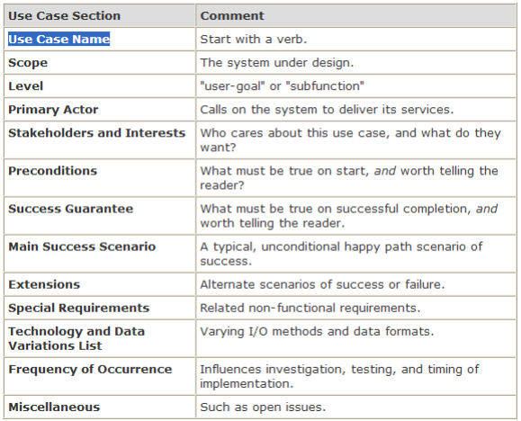
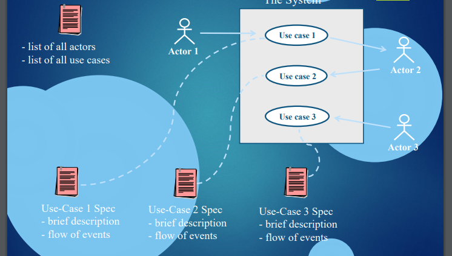
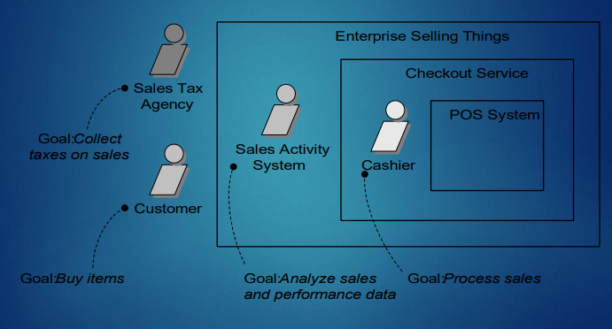
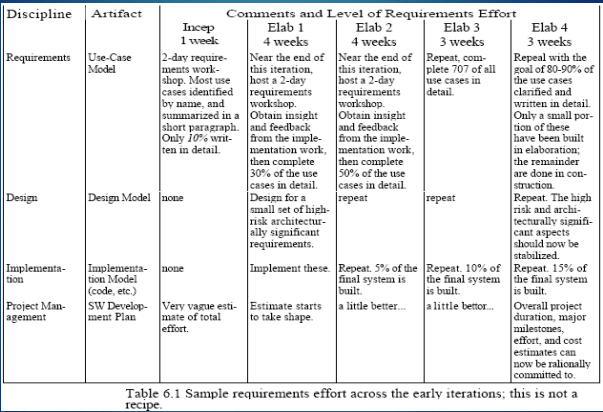

Описание на поне 5-6 системи
Описания какво нашата система допринася към новите системи

# Use Case modeling / Потребителски случаи

- Свързва stakeholders със софтуерните изисквания.
- Задава ясни граници на системата.
- Прихваща и комуникира очакваното държане на системата
- Идентифицира кой или какво общува със системата
- Валидирана изискванията
- Инструмент за планиране

## Основни концепции

- Разпространен механизъм за откриване и записване на изисквания, предимно функционални и други типове свързани със случаите
- Описанието на потребителски случаи е отлична техника за разбиране и описание на функционалните изисквания
- Use-Case model - част от описанието на изисквания в UP (Unified Process)
- Потребителските случаи не са обектно ориентирани

## Сценарий (scenario) - от Sequence model

- Определена последователност от действия и взаимодействия между актьорите и системата
- Определен сюжет за използване на системата или един възможен път на потребителския случай

## Пример за сценарий - Теглене на пари от банкомат

## Use case - Потребителски случай (Елипса)
    Описва съвкупност от събития извършени от системата, които връщат забележим резултат със стойност за определен актьор

- множество от свързани успешни и неуспешни сценарии, които описват как актьорът използва системата за постигане на своя цел. 

## Use-Case Spec - Описание на потребителски случаи //// От артефакт модела
    Описание на потребителски случай

- Списък на всички актьори
- Списък на всички случаи
- кратко описание за специфичен случай
- Процес, поредица на действията

### Формат на описание

- Кратък (brief)
    - Сбито резюме от един параграф
    - Описва основния успешен сценарий
- Неформален (casual)
    - Няколко параграфа, които описват различни сценарии
- Пълен (fully dressed)
    - Най-подробен
    - Добре структуриран
    - Описва всички стъпки и варианти в детайли
    - Има допълнителни раздели като предусловия, гаранция за успех и др.
    - Вариант 2 колони
        - Действията на актьора и системата в основния успешен сценарий се редуват в две колони
        - Няма значение кой вариант ще се ползва

### Секции на описание

- Уводни елементи
    - Поставят се само такива, които е важно да се прочетат преди основния успешен сценарий
- Списък на заинтересованите лица
- Предусловия
    - Започват какво задължително трябва да е изпълнено преди започване на сценария в потребителския случай
    - Обикновено предполагат успешно завършване на друг потребителски случай
- Резултати (Следусловия)
    - Посочват какво трябва да е изпълнено при успешно завършван е на потребителския случай - основния успешен сценарии или на някой от алтернативните
    - Трябва да удовлетворяват нуждите на всички заинтересовани лица
- Основен успешен сценарий (Basic Flow)
    - описва типичния успешен път на use-case, който удовлетворява интересите на заинтересованите лица
    - Не включва условия и разклонения - те са в алтернативните сценарии
- Стъпки на сценария
    - Взаимодействие между актьор и система
    - Валидация от системата
    - Промяна на състояние на системата
- Алтернативни сценарии (Alternate Flow, Extensions)
    - Съдържат всички други сценарии и разклонения, както успешни така и неуспешни
    -  Комбинацията от основния сценарий и алтернативните сценарии трябва да удовлетворява почти всички интереси на заинтересованите лица
    - Те са разклонения на основния сценарий и се номерират спрямо номерацията на стъпките в него
    - Състоят се от условие и обработка
        - Условието е добре да се запише като нещо, което може да бъде прихванато от системата или някой актьор
        - Обработката може да се резюмира в една стъпка, или да включва няколко стъпки
        - В края на обработката алтернативният сценарий се слива с основния, освен ако в него не е посочено друго
        - Ако е много сложен, може да се обособи в самостоятелен потребителски случай
- Специални изисквания
    - Съдържат нефункционални изисквания, качествени атрибути или ограничения
    - Ако се отнасят конкретно за потребителския случай, то се описват в самия него
    - Препоръчва се всички тези изисквания да се отделят за по-добра четимост, разбиране, мениджмънт
- Вариации в технологиите и данните
    - Технически ограничения, задаващи технологии, които трябва да поддържа системата
    - Различни вариации на данни, с които системата трябва да може да работи

## Актьор - от flow model (Човече)
    Неща с поведение: човек (идентифицира се с роля), компютърна система или организация

- Правоъгълник се ползва за системи
- Главни (primary) актьори – техните цели се изпълняват чрез системата.
- Поддържащи (supporting) актьори – предоставят услуги на системата
- Списък актьор – цел (за всеки актьор се записват целите)
- Главните актьори и потребителските цели зависят от границите на системата
- Процедура за откриване на потребителските случаи
    - Откриване на целите на потребителите
    - За всяка цел - дефиниране на потребителски случай

## Пример за цялостна графика

## Граници на системата

## Потребителски случаи на фази

-----------------
Трябва да подредим use-case по определен критерий,
който избираме