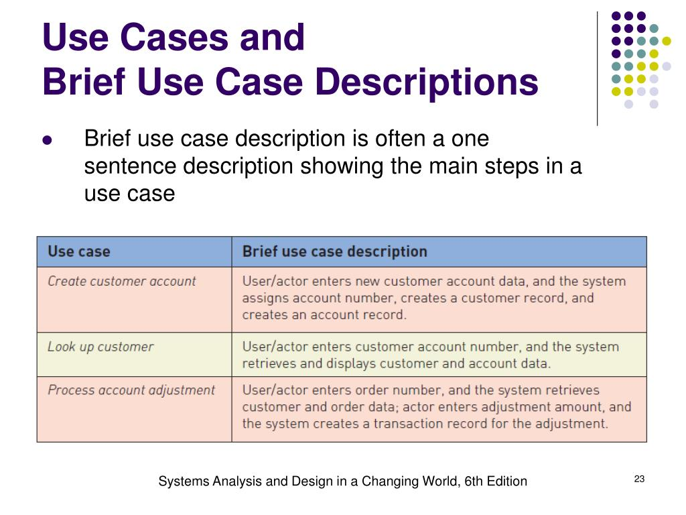

Фиксиране на финални stakeholder-и

Обсъждане какви са ни изискванията от моделите

Обсъждане какво трябва да отиде в източници и речник
- артефакти
- системи (системите не са Stakeholder-и и е добре да бъдат преместени в речник)

+ № CD модели обсъждане и коригиране

№ Калинка спомена, че очаква вече да правим use-case
Вариант да измислим по CD моделите use-cases във формат 
Кратък (brief)
- Име на use-case: Глагол + Обект
- Сбито резюме от един параграф
- Описва основния успешен сценарий

----------------

Use case suggestions

----
## ОДОБРЕНО

Use case: Одобряване на заявка за регистрация 
Описание: 
Администраторът влиза в системата, преглежда чакаща заявка за регистрация, проверява подадената информация, променя заявката, след което системата изпраща уведомление и записва действието в лог.

----
## ОДОБРЕНО

Use case: Планиране на кулинарно пътешествие
Актьор: Турист 

Описание: 
Туристът разглежда наличните кулинарни туровe, въвежда своите предпочитания, избира желан маршрут. След това попълва резервация и следи информация по резервация.

----
Use case
Туроператорът координира с ресторантите, винарните и местните производители, които потвърждават наличността и организират събитията. Ако не потвърдят наличността, туроператорът предлага алтернативни опции или отменя резервацията. Туристът, получил потвърждение, участва в тура, след което може да остави отзиви за преживяването.

----

## ОДОБРЕНО ?

Use case: Добавяне на нов кулинарен тур​
Актьор: Туроператор
Описание: Туроператорът влиза в системата, попълва форма за тур, добавя нов кулинарен тур и търси допълнителни участници за тура.

----

## ОДОБРЕНО

Use case Регистриране на Кулинарен бизнес
Винарната достъпва страницата за регистрация, попълва и изпраща формата за регистриране на производител. Системата валидира информацията чрез Администратора и при успех потвърждава регистрацията, предоставяйки достъп до функционалностите на платформата.

----

## ОДОБРЕНО

Use Case: Оценяване на кулинарен бизнес
Актьор: Турист
Описание:
Туристът получава анкета за тур, избира заведение или цялостния тур, попълва форма за отзив и изпраща отзив. Получателят на отзива връща отговор на отзива.

----

<!-- Use Case: Посещаване на местен производител
Туристът разглежда наличните местни производители на платформата и избира желаното място за посещение. След това прави резервация, като попълва дата и брой участници. 
Администраторът координира с местния производител, който потвърждава наличността и подготвя дегустацията или демонстрацията. Ако производителят не е наличен, 
администраторът предлага алтернативни опции или отменя резервацията. При потвърждение, транспортната агенция организира превоза на туристите, а екскурзовода(гид-а) ги 
съпровожда. След посещението туристът може да остави отзиви за преживяването. -->

----

## ОДОБРЕНО

Use case: Обработване на оплаквания
Актьор: Администратор
Описание:

Турист избира посетен тур, попълва форма за оплакване и изпраща формата. Администраторът отваря списък с оплаквания, избира оплакване, проверява информацията, проверява данните на участниците в тура. Свързва се с туроператора, коригират тур.