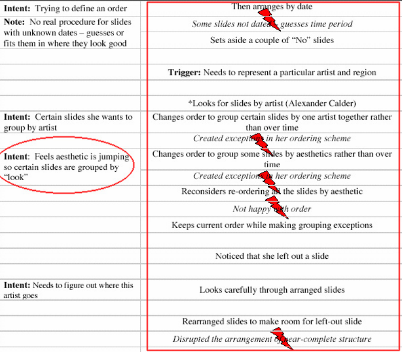
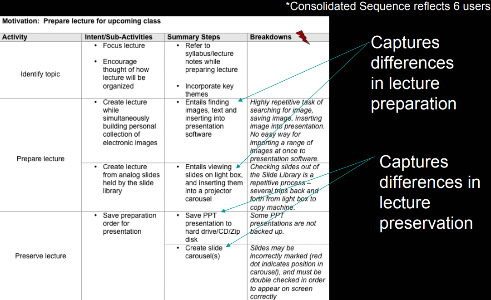

# Модел на последователността

## Елементи

- Име 
    - Задължително да има глагол.
    - Пример: U06 Sequence 1: Plan family trip
- Цел (Intent)
    - Резултат, който искаме да постигнем
    - Представянето трябва да има ясно разделяне за всяка цел
- Тригер (Trigger)
    - Възприемано събитие или състояние, което предизвиква изпълнението на последователността от действия. Често е външно явление извън самата система. Пример: Решаваме да качим статия
- Стъпка (Activity)
    - действие за осъществяване на цел
- Проблемна област (BD)
    - проблем при изпълнението
    - Стои след стъпката, за която се отнасят.

## Видове

- Индивидуални
    - Използват се по-късно за консолидираните модели
    

- Консолидирани
    - За всички представители на дадена роля

## Бележки

- Трябва да има единен процес за описание и работа по задачите. Един шаблон
- Диаграмите могат да станат тежки за четене.
- Табличния вид може да имаме добре дефинирани колони за различни стъпки и под цели, изпълняващи се паралелно
- Етикетите са задължителни и се слагат преди описанието на елемента
- Източник на примери: Контекстуално Проектиране К. Холцблат и Х.Бейкър
- Включване на инструменти (Google maps, email) и ръчни методи (face to face, ask someone) за осъществяване на стъпка
- Някои стъпки могат да бъдат опростени и изнесени в artifact моделът
- Имейли не са добри кандидати за артефакти
- Артефакт - полетата нямат смисъл от коментари, ако имат описателен етикет. Пример: поле за имейл
- Нужен е подробен анализ. Предаваме общото решение 1 версия и извличаме частите, в които сме участвали в своята индивидуална част.

### AsIs 
- Flow
- Sequence
- Artifact

Двата казуса/подхода, които обсъждахме реално са едни и същи. Главното тук е
подробен анализ на методите за извличане на изискванията. Така ще извлечем нужните ни елементи за проекта. 

### ToBe
- Use-case
- Vision
- UCM
- Surf/System (беше нечетимо) Spec
