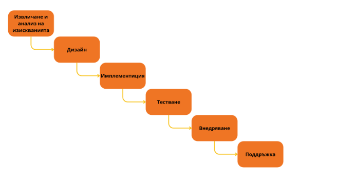

# Тема 01 - Място на доставката в цялостния жизнен цикъл на софтуера

## Жизнен цикъл на софтуера?

От появата на идеята до появата на пазара и последващата поддръжка
### Фази:
- #### <u>Извличане и анализ на изискванията:</u> 
    > Правят се необходимите проучвания и се анализират (документират и описват максимално), с цел максимална пълнота и точност на изискванията на целевата ни групата. Изискванията се приоритизират. 

- #### <u>Дизайн</u>
    > Изгражда се дизайн на архитектурата, на потребителското изживяване, програмните интерфейси (**API**), конзолни интерфейси (**CLI**). 
    > Много е важно да се тества с целевата ни група за валидация на дизайна.
    > Крайния резултат е документиран дизайн, включващи диаграми, описания, прототипи и други

- #### <u>Имплементация</u>
    > Имплементация на софтуера спрямо дизайна, изграждане на софтуерния продукт

- #### <u>Тестване</u>
    > Проверка на софтуера за дефекти. 
    > Тестване на положителни сценарии, симулиране на невалидни сценарии и грешки. 
    > Целта е да сме сигурни, че отговаряме на изискванията

- #### <u>Внедряване</u>
    > Фазата, която прави продукта достъпен за целевата група

- #### <u>Поддръжка</u>
    > Фаза за отстраняване на дефекти, открити след експлоатация на продукта, предоставя консултация относно употреба, конфигурация и други аспекти.
    > Предоставя малки подобрения към продукта (по-добра практика да се прави, чрез нова версия на продукта и да се мине отново през фазите)

### Модел на водопада (waterfall)

> Модел с ограничена гъвкавост, без предвиждане на междинни версии, итерации и обратна връзка.