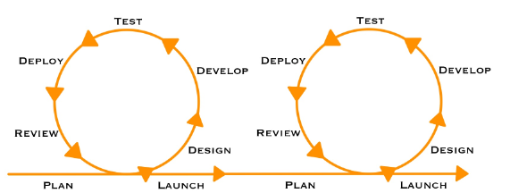
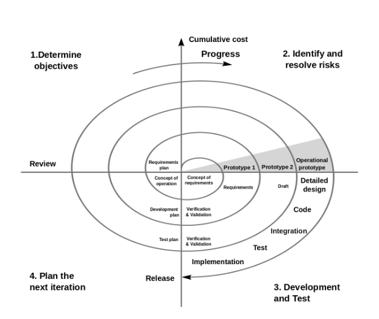

# Тема 01 - Място на доставката в цялостния жизнен цикъл на софтуера

## Жизнен цикъл на софтуера?

От появата на идеята до появата на пазара и последващата поддръжка
### Фази:
- #### <u>Извличане и анализ на изискванията:</u> 
    > Правят се необходимите проучвания и се анализират (документират и описват максимално), с цел максимална пълнота и точност на изискванията на целевата ни групата. Изискванията се приоритизират. 

- #### <u>Дизайн</u>
    > Изгражда се дизайн на архитектурата, на потребителското изживяване, програмните интерфейси (**API**), конзолни интерфейси (**CLI**). 
    > Много е важно да се тества с целевата ни група за валидация на дизайна.
    > Крайния резултат е документиран дизайн, включващи диаграми, описания, прототипи и други

- #### <u>Имплементация</u>
    > Имплементация на софтуера спрямо дизайна, изграждане на софтуерния продукт

- #### <u>Тестване</u>
    > Проверка на софтуера за дефекти. 
    > Тестване на положителни сценарии, симулиране на невалидни сценарии и грешки. 
    > Целта е да сме сигурни, че отговаряме на изискванията

- #### <u>Внедряване</u>
    > Фазата, която прави продукта достъпен за целевата група

- #### <u>Поддръжка</u>
    > Фаза за отстраняване на дефекти, открити след експлоатация на продукта, предоставя консултация относно употреба, конфигурация и други аспекти.
    > Предоставя малки подобрения към продукта (по-добра практика да се прави, чрез нова версия на продукта и да се мине отново през фазите)

### Модел на водопада (waterfall)

> Модел с ограничена гъвкавост, без предвиждане на междинни версии, итерации и обратна връзка.

### Гъвкави методологии (agile)
> Методологии базирани на гъвкавост, итерации и сътрудничество
> Примери SCRUM, Kanban, XP

### Спираловиден модел (spiral)
> Комбинира елементи от гъвкавите методологии със стратегическото планиране и рисковете на традиционните подходи
> Този подход се базира на итерации, където се изпълняват определени дейности

> Всяка итерация има следните фази: Планиране, Анализ на рисковете, Разработка, Оценка на резултата и подготовка на следваща итерация.

> Моделът е подходящ за сложни проекти, с високи рискове и изисквания на склонни да се променят.  

## Понятието "доставка на софтуер"
> Това е процесът, в резултат на който клиентите и потребителите получават възможност да боравят с нашия софтуерен продукт

> Това не включва само физическия достъп, но подсигуряването че той се предоставя в
> съответните правни изисквания (**нормативната уредба**), изискванията на приложната област (**индустриални изисквания**), утвърдени стандарти и организационните изисквания (на клиента и на производителя).

> Този процес цели самото предоставяне да е систематично и стандартизирано, както и предоставяното на необходимите сертификати

## Мястото на доставката в жизнения цикъл на софтуера
> Процесът на внедряване е фактическата доставка
> Доставката на софтуер играе главна роля в събиране и анализа на изисквания
> За добре изпълнена доставка на софтуера е необходимо да се осъществи наблюдение върху целия жизнен процес 

## Обобщение
> Доставката на софтуер е абстрактен процес на високо ниво, който се грижи за цялостната успешна поява на софтуерния продукт на своя целеви пазар.