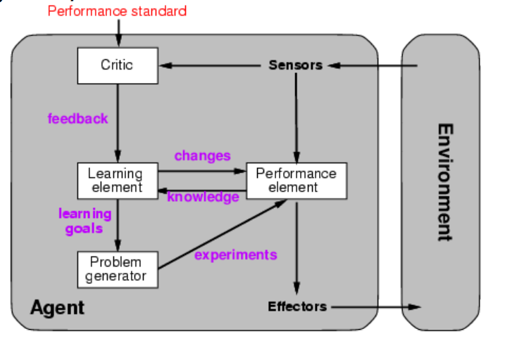
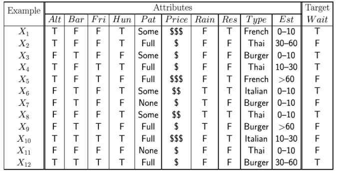
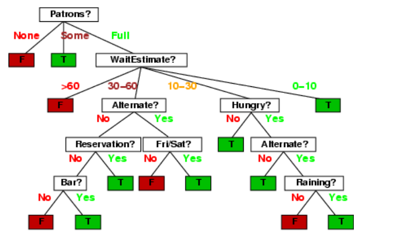
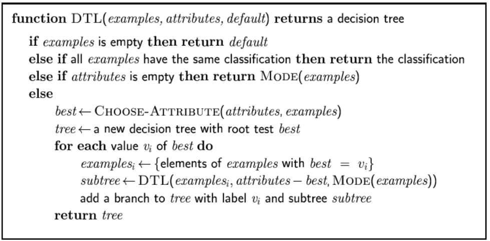
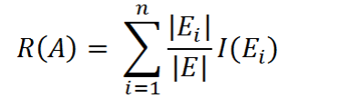

# Тема 14 - Машинно самообучение

## Същност на машинното самообучение (Machine Learning)
    Самообучението означава настъпване на такива
    промени в системата, които са адаптивни в смисъл, че позволяват
    на тази система при всеки следващ опит да извършва дадена
    работа по-ефективно и по-ефектно, отколкото при предишните
    опити

## Типове машинно самообучение в зависимост от характера на обратната връзка

- Машинно самообучение с учител (наблюдавано МС,
supervised machine learning)
- Машинно самообучение без учител (ненаблюдавано МС,
unsupervised machine learning)

## МС чрез запомняне- NN; k-NN
    методът на най-близкия съсед (NN – Nearest Neighbour)
    методът на k най-близки съседи (k-NN)

y - стойност на целевия (резултат класиране)
(x->,y->) описваме обект чрез двойка атрибут-стойност (вектори от atrib #a атрибути)

Типове на атрибути
числови
булеви
номинални

## Самообучение чрез примери

### Индуктивно МС - класификационни дървета (decision trees)

> - Подход на **отделяне** - примерите за даден клас да се отделят от тези на другите класове
> - Всеки възел в едно КД представя даден атрибут, срещащ се в примерите
> - Дъгите,излизащи от даден възел, представят различните възможни стойности на този атрибут
> - Всеки лист на дървото определя класификацията на даден пример, като стойностите на съответните атрибути са зададени по пътя от корена към този лист

#### Пример:

#### Избор на "най-добрият" атрибут
    Най-добрият атрибут е този,
    при който се получава най-малка стойност на ентропията.

I = – ∑ Pi log2(Pi) , където Pi (i = 1, … , n)

Информацията, необходима за довършване на дървото след
избора на А като корен, е:

