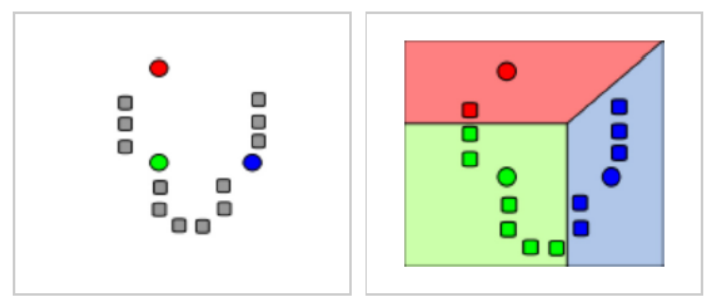
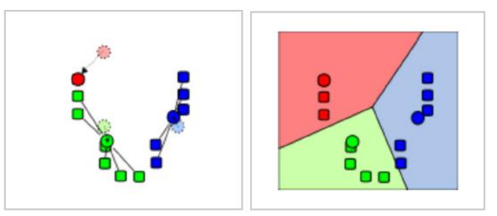

# Kлъстеризация
    Групиране на набор от обекти (вектори или точки), така че
    обектите от една и съща група да са подобни помежду си и да се
    различават от обектите в останалите клъстери.

- hard клъстеризацията
    > всеки обект попада в точно един клъстер. При
- soft клъстеризацията 
    > всеки обект може да попадне в повече от един клъстер, като за  
    > всеки клъстер, в който попада, обектът  
    > притежава съответна степен на принадлежност.  

## МС без учител - клъстеризация k-means?
     Стреми се да раздели обектите на k клъстера по следния начин

- По случаен начин се избират центровете на всички клъстери
- Повтарят се следните стъпки:
    - всеки обект се асоциира с (причислява към) клъстера с най-близък център;
    - замества се всеки център на клъстер със средното на всички обекти, асоциирани с него.

Клъстеризацията зависи строго от нулевата стъпка

### Пример: 

    
    

## Йерархично клъстериране