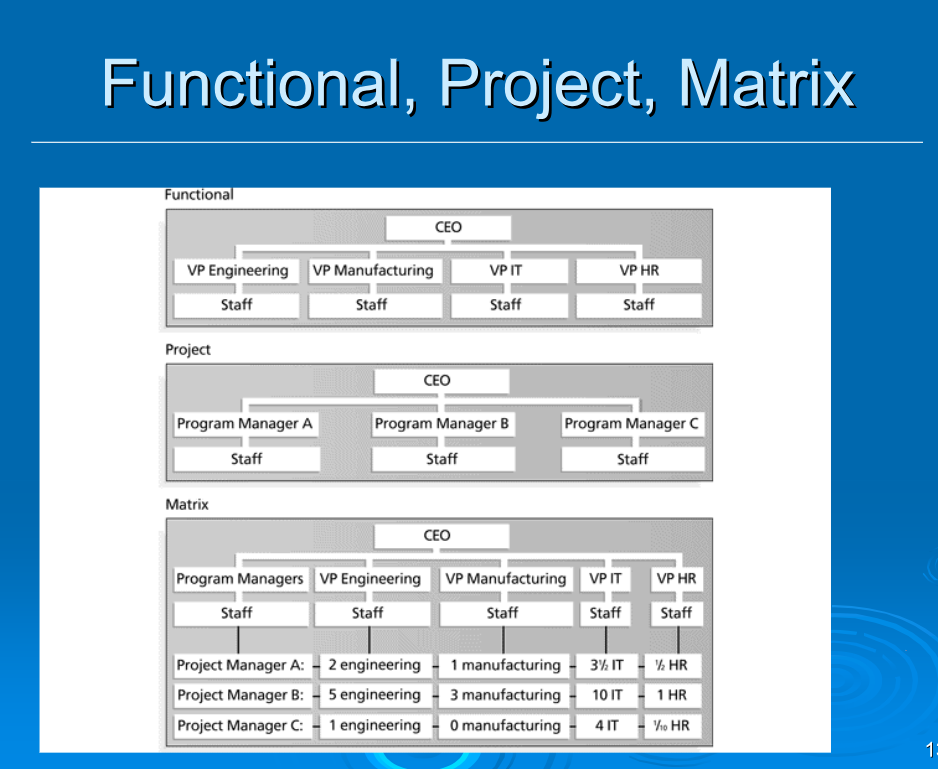
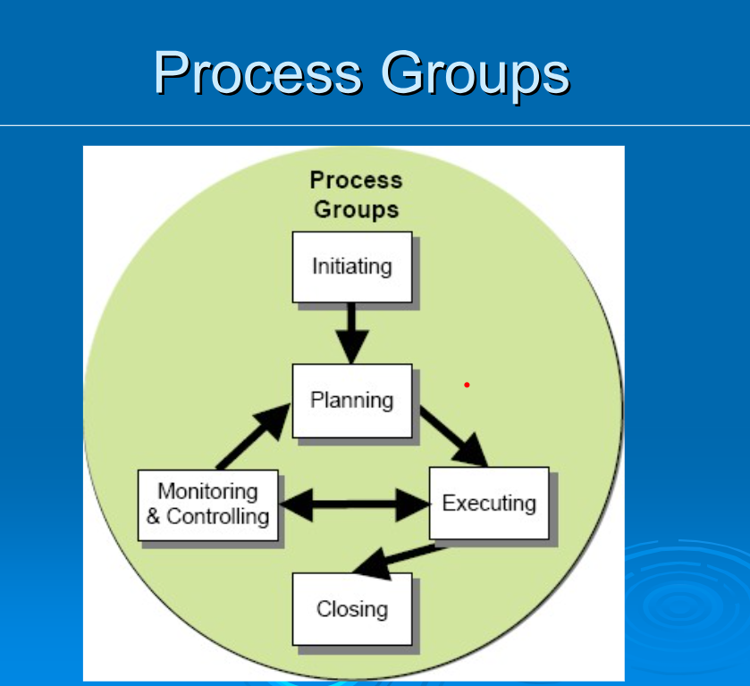
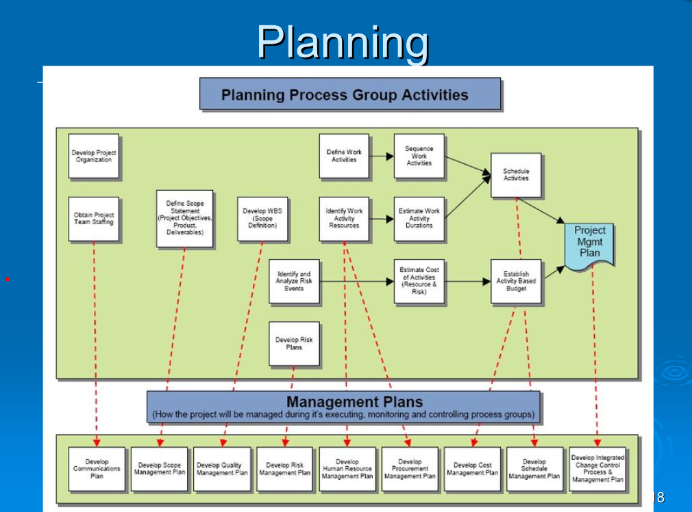
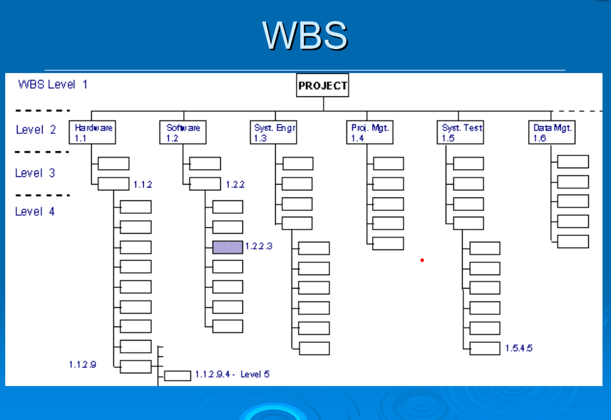

Отговорниците трябва да се явят понеделник на лекцията
за съставяне на финалните екипи, ако ли не ще се излъчват нови отговорници

Относно за хората от минали години
Хората, които ще се явяват тази година, а са прекъснали, също задължително се явяват в понеделник.
Хората от минала година губят двата официални опита, тоест
няма да ги вкарат в протокол, ако го минат сега, докато не влязат в 4-ти курс
Но в 4-ти курс губят явяванията си.

Важен триъгълник: време,цена,цел, 
Допълнителни: качество, риск

Междинни точки - всяка итерация
Deliverables - списък изисквания, диаграми, т.н. (не се ползва думата ресурс) 

а цялостно сме на проектна
ние сме в хибридна структура (по групи)

Трябва да си изберем и изградим набор от шаблони за изграждането на документите

