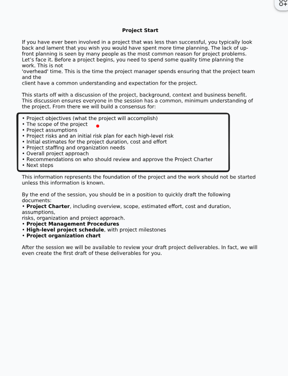

Имах въпрос относно диаграмата на Грант, тъй като зелената част е извършената работа по дадена задача.
Как има извършена работа по задачи, зависими от завършването на задачи, които не са започнати.

Например, задача 5 и 7 не са завършени, а се счита ключов момент 7 за завършен и е започната 10-та задача

# Управление на Цена на проекта

## Оценяване

- Какви усилия са необходими
- Какво време е необходимо
- Какви са цялостните разходи
- Обща оценка и разписание
- Определяне на дейностите по управлението

## Компоненти на цената на софтуера

- Разходи за хардуер и софтуер
- Разходи за пътувания и обучение
- Разходи за усилията за създаване на софтуер (основен фактор в повечето проекти)

## Разходи и оценки

Oценката се прави за определяне на цената, която трябва да плати разработчика
 за разработвания продукт
Връзката между разходите за разработка и цената за клиента не е еднопосочна
Широк спектър от организационни, икономически, политически и бизнес

Провери потребителските случаи как се ползват за оценяване