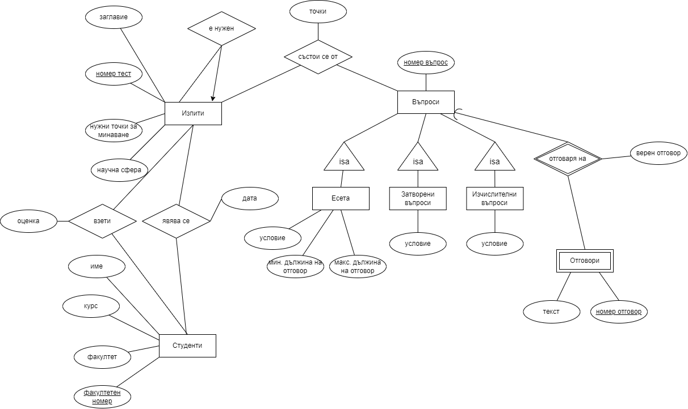

## Иван Петров 3MI0700035

Students(<ins>fn</ins> : string(10), name : string(100), faculty : string(100),course : int)
  PK: (<ins>fn</ins>, unique, not null)
  CK: (course > 0)

Exams(<ins>nexam</ins> : int, title : string(100), minpoints : int, field : string(100), needed_nexam : int)
 PK: (<ins>nexam</ins>, unique, not null)
 FK: (needed_nexam)
 CK: (minpoints > 0)

TakesExams(<ins>fn</ins> : string(10), <ins>nexam</ins> : int, date : date)
 PK: (<ins>fn</ins>, <ins>nexam</ins>, unique, not null)
 FK: (<ins>fn</ins>, <ins>nexam</ins>)

TakenExams(<ins>fn</ins> : string(10), <ins>nexam</ins> : int, grade : decimal)
 PK: (<ins>fn</ins>, <ins>nexam</ins>, unique, not null)
 FK: (<ins>fn</ins>, <ins>nexam</ins>)
 CK: (grade >= 2)

ConsistsOf(<ins>nexam</ins> : int, <ins>nquestion</ins> : int, points : decimal)
 PK: (<ins>nexam</ins>, <ins>nquestion</ins> , unique, not null)
 FK: (<ins>nexam</ins>, <ins>nquestion</ins> )
 CK: (points >= 0)

Answers(<ins>nanswer</ins>, text, <ins>nquestion</ins>, is_right_answer : boolean)
  Отговорите са слаби множества
 PK: (<ins>nanswer</ins>, text, <ins>nquestion</ins>, unique, not null)
 FK: (<ins>nquestion</ins>)
 CK: (is_right_answer - 0, 1)

----

### Първи вариант

Questions(<ins>nquestion</ins> : int)
 PK:(<ins>nquestion</ins>, unique, not null)

Essays(<ins>nquestion</ins> : int, condition : string(100), min_length : int, max_length : int)
 PK:(<ins>nquestion</ins>, unique, not null)
 FK:(<ins>nquestion</ins>)
 CK: (min_length > 0)
 CK: (max_length >= min_length)

ClosedQuestions(<ins>nquestion</ins> : int, condition : string(100))
 PK:(<ins>nquestion</ins>, unique, not null)
 FK:(<ins>nquestion</ins>)

CalculationQuestions(<ins>nquestion</ins> : int, condition : string(100))
 PK:(<ins>nquestion</ins>, unique, not null)
 FK:(<ins>nquestion</ins>)

----

### Втори вариант

Questions(<ins>nquestion</ins> : int, condition : string(100), min_length : int, max_length : int) 
 PK:(<ins>nquestion</ins>, unique, not null)
 CK: (min_length > 0)
 CK: (max_length >= min_length)

----

За въпросите избирам първия вариант заради по-изчистения вид на атрибутите (липсата на много NULL атрибути, които могат да доведат до грешки), ако в бъдеще добавим още атрибути към въпросите.